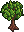

## Hi, this is SweTree

SweTree is a small project that I created for fun. It's a web application that allows users to learn Swedish whilst growing trees and watching different statistics increase! The application features over 800 hand-translated common Swedish words with translations that make sense. I hope you will enjoy testing our using the site!

If you're interested in more of my work and who I am feel free to check out my GitHub or LinkedIn, both can be found from my profile!

## Learn More

SweTree is built using a number of different technologies, including NEXT.js, React, and TypeScript. It's hosted on the Vercel platform, which makes deployment a breeze.

While I'm happy with how SweTree turned out, there's always room for improvement. In the future, I'd like to increase the amount of words that is possible to learn and further develop the spelling / misspelling system to give the user more feedback when typing correctly or incorrectly.

If you have any suggestions or feedback for how I can improve SweTree, please don't hesitate to reach out. I'm always looking for ways to make the app better and more useful for people who might be interested.

## To run locally

I recommend using Visual Studio Code as it is the environment SweTree has been developed in.

1. Download the Repo
2. Open the terminal
3. write 'npm install'
4. write 'npm run dev' to run locally without building

